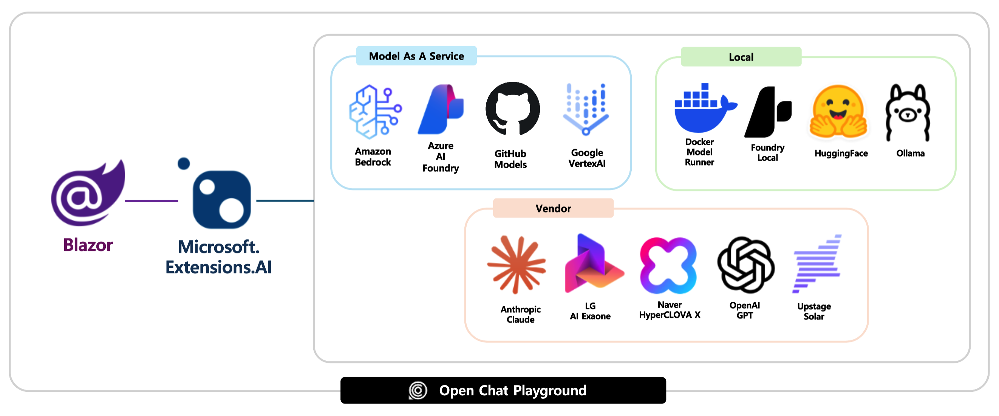

#  Open Chat Playground

Open Chat Playground (OCP) is a web UI that is able to connect virtually any LLM from any platform.



## Supported platforms

- [x] [Amazon Bedrock](https://docs.aws.amazon.com/bedrock)
- [x] [Azure AI Foundry](https://learn.microsoft.com/azure/ai-foundry/what-is-azure-ai-foundry)
- [x] [GitHub Models](https://docs.github.com/github-models/about-github-models)
- [ ] [Google Vertex AI](https://cloud.google.com/vertex-ai/docs)
- [x] [Docker Model Runner](https://docs.docker.com/ai/model-runner)
- [x] [Foundry Local](https://learn.microsoft.com/azure/ai-foundry/foundry-local/what-is-foundry-local)
- [x] [Hugging Face](https://huggingface.co/docs)
- [x] [Ollama](https://github.com/ollama/ollama/tree/main/docs)
- [x] [Anthropic](https://docs.anthropic.com)
- [ ] [Naver](https://api.ncloud-docs.com/docs/ai-naver-clovastudio-summary)
- [x] [LG](https://github.com/LG-AI-EXAONE)
- [x] [OpenAI](https://openai.com/api)
- [x] [Upstage](https://console.upstage.ai/docs/getting-started)

## Prerequisites

- [Azure Subscription](https://azure.microsoft.com/free)
- [.NET SDK 9](https://dotnet.microsoft.com/download/dotnet/9.0)
- [Visual Studio Code](https://code.visualstudio.com/) + [C# DevKit](https://marketplace.visualstudio.com/items?itemName=ms-dotnettools.csdevkit) or [Visual Studio 2022 v17.14+](https://visualstudio.com/vs)
- [Docker Desktop](https://docs.docker.com/desktop/)
- [Azure Developer CLI](https://learn.microsoft.com/azure/developer/azure-developer-cli/install-azd)
- [GitHub CLI](https://cli.github.com/)
- [PowerShell 7.5+](https://learn.microsoft.com/powershell/scripting/install/installing-powershell) 👉 Windows only

## Getting started

### Get the repository ready

1. Login to GitHub.

    ```bash
    gh auth login
    ```

1. Check login status.

    ```bash
    gh auth status
    ```

1. Fork this repository to your account and clone the forked repository to your local machine.

    ```bash
    gh repo fork aliencube/open-chat-playground --clone --default-branch-only
    ```

1. Navigate to the cloned repository.

    ```bash
    cd open-chat-playground
    ```

### Run on local machine

- [Use Amazon Bedrock](./docs/amazon-bedrock.md#run-on-local-machine)
- [Use Azure AI Foundry](./docs/azure-ai-foundry.md#run-on-local-machine)
- [Use GitHub Models](./docs/github-models.md#run-on-local-machine)
- [Use Docker Model Runner](./docs/docker-model-runner.md#run-on-local-machine)
- [Use Foundry Local](./docs/foundry-local.md#run-on-local-machine)
- [Use Hugging Face](./docs/hugging-face.md#run-on-local-machine)
- [Use Ollama](./docs/ollama.md#run-on-local-machine)
- [Use Anthropic](./docs/anthropic.md#run-on-local-machine)
- [Use LG](./docs/lg.md#run-on-local-machine)
- [Use OpenAI](./docs/openai.md#run-on-local-machine)
- [Use Upstage](./docs/upstage.md#run-on-local-machine)

### Run in local container

- [Use Amazon Bedrock](./docs/amazon-bedrock.md#run-in-local-container)
- [Use Azure AI Foundry](./docs/azure-ai-foundry.md#run-in-local-container)
- [Use GitHub Models](./docs/github-models.md#run-in-local-container)
- [Use Docker Model Runner](./docs/docker-model-runner.md#run-in-local-container)
- ~~Use Foundry Local~~ 👉 NOT SUPPORTED
- [Use Hugging Face](./docs/hugging-face.md#run-in-local-container)
- [Use Ollama](./docs/ollama.md#run-on-local-container)
- [Use Anthropic](./docs/anthropic.md#run-on-local-container)
- [Use LG](./docs/lg.md#run-in-local-container)
- [Use OpenAI](./docs/openai.md#run-in-local-container)
- [Use Upstage](./docs/upstage.md#run-in-local-container)

### Run on Azure

- [Use Amazon Bedrock](./docs/amazon-bedrock.md#run-on-azure)
- [Use Azure AI Foundry](./docs/azure-ai-foundry.md#run-on-azure)
- [Use GitHub Models](./docs/github-models.md#run-on-azure)
- ~~Use Docker Model Runner~~ 👉 NOT SUPPORTED
- ~~Use Foundry Local~~ 👉 NOT SUPPORTED
- [Use Hugging Face](./docs/hugging-face.md#run-on-azure)
- [Use Ollama](./docs/ollama.md#run-on-azure)
- [Use Anthropic](./docs/anthropic.md#run-on-azure)
- [Use LG](./docs/lg.md#run-on-azure)
- [Use OpenAI](./docs/openai.md#run-on-azure)
- [Use Upstage](./docs/upstage.md#run-on-azure)

### Run as API

1. Run the app - either locally or remotely.
1. Navigate to `{{APP_URL}}/openapi.json` to see the OpenAPI doc. **NOTE**: the OpenAPI doc is only able to see on a local machine, not on a remote instance.
1. Send a `POST` request to `{{APP_URL}}/api/chat/responses` with a request payload like:

    ```json
    [
      {
        "role": "system",
        "message": "You're a friendly assistant"
      },
      {
        "role": "user",
        "message": "Why is the sky blue?"
      }
    ]
    ```

1. Confirm the response payload like:

    ```jsonc
    [
      {
        "role": "assistant",
        "message": "Because "
      },
      {
        "role": "assistant",
        "message": "It's "
      },
      {
        "role": "assistant",
        "message": "... "
      },
      ...
      {
        "role": "assistant",
        "message": "... "
      }
    ]
    ```

### Run tests

#### Build app

1. Make sure you are at the repository root.

    ```bash
    cd $REPOSITORY_ROOT
    ```

1. Build the app.

    ```bash
    dotnet restore && dotnet build
    ```

#### Unit tests

1. Make sure you are at the repository root.

    ```bash
    cd $REPOSITORY_ROOT
    ```

1. Run tests.

    ```bash
    dotnet test --filter "Category=UnitTest"
    ```

#### Integration tests

1. Make sure you have the Ollama server up and running on your local machine.

    ```bash
    ollama serve
    ollama run hf.co/Qwen/Qwen3-0.6B-GGUF
    ```

1. Make sure you are at the repository root.

    ```bash
    cd $REPOSITORY_ROOT
    ```

1. Install playwright.

    ```bash
    pwsh $REPOSITORY_ROOT/test/OpenChat.PlaygroundApp.Tests/bin/Debug/net{YOUR_VERSION}/playwright.ps1 install
    ```

1. Run the app.

    ```bash
    dotnet run --project $REPOSITORY_ROOT/src/OpenChat.PlaygroundApp -- --connector-type HuggingFace
    ```

1. Run tests.

    ```bash
    # With LLM provider
    dotnet test --filter "Category=IntegrationTest"
    ```

    ```bash
    # Without LLM provider
    dotnet test --filter "Category=IntegrationTest & Category!=LLMRequired"
    ```

### Configure GitHub Actions for CI/CD Pipeline

1. Make sure you are at the repository root.

    ```bash
    cd $REPOSITORY_ROOT
    ```

1. Make sure you've logged in to Azure.

    ```bash
    azd auth login --check-status
    ```

1. Run pipeline config.

    ```bash
    azd pipeline config
    ```

1. Answer the question below:

   - `? Select how to authenticate the pipeline to Azure` 👉 `Federated Service Principal (SP + OIDC)`
   - `? Would you like to commit and push your local changes to start the configured CI pipeline?` 👉 `No`

1. Once the configuration is done, push a new commit to GitHub to run the GitHub Actions workflow.
